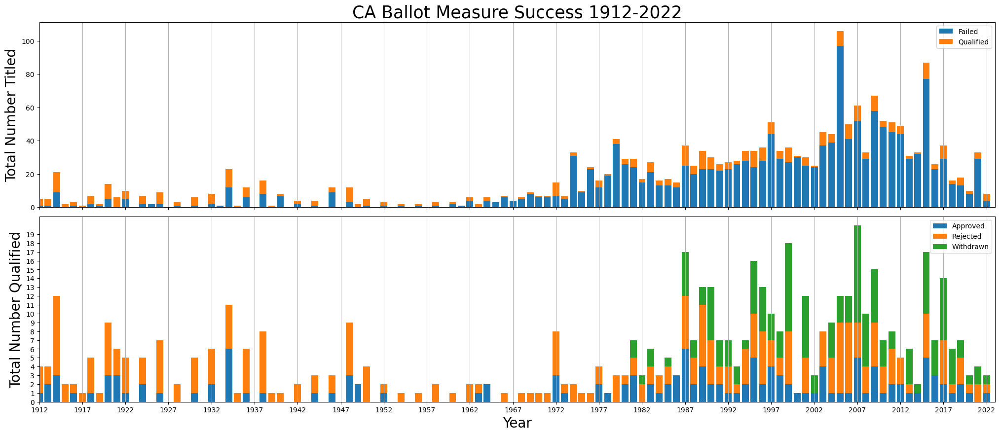

# Predicting California State Ballot Measure Success

The CA Secretary of State has [historical records on ballot measures starting in 1912](https://www.sos.ca.gov/elections/ballot-measures/resources-and-historical-information/history-california-initiatives), and we're attempting to calculate probabilities for the [2024 ballot measures](https://calmatters.org/commentary/2023/08/2024-california-ballot-measures-battles/) based on the historical average. Over more than 100 years, ballot measures, once qualified and put on the ballot, succeed 35% of the time. Since a ballot measure either succeeds or fails on a majority vote, a binomial distribution seems appropriate, though we are not completely certain that a variation wouldn't be a better fit, especially since the measures themselves are likely not fully independent sequential events. From other posts, we see that a [quasi-binomial](https://stats.stackexchange.com/questions/356046/binomial-vs-quasi-binomial-model), [negative binomial](https://stats.stackexchange.com/questions/176034/negative-binomial-distribution-vs-binomial-distribution), [poisson and beta binomial distributions](https://stats.stackexchange.com/questions/390023/poisson-binomial-vs-beta-binomial) are other possibilities. How can we choose the best distribution for this situation? Do we need to run a few models with different parameters? How would we compare them?

As well, each election is distinct, so there could be some lurking variables that might lend themselves better to a variety of linear model? For example, amount of money raised, midterm election or not and the party affiliation of those backing the ballot measure. Rather than controlling for too many of these, which are difficult to collect, perhaps it would be enough to use an average p of success from a subgroup of more recent, similar elections? For example, only using the last 30-40 years and separating presidential elections from midterm elections.

If we set these concerns aside and use the 35% p of success on the current 7 ballot initiatives set to appear on the 2024 ballot, the binomial probability that 2 succeed is about 30%, and the cumulative probability that 2 or fewer succeed is about 53%.

## Exploratory Data Analysis
Source: CA Secretary of State: https://elections.cdn.sos.ca.gov//ballot-measures/pdf/initiative-totals-summary-year.pdf
This is aggregated information about this raw set: https://elections.cdn.sos.ca.gov/ballot-measures/pdf/initiatives-by-title-and-summary-year.pdf

#Looks like modern era (after 1970 or so) has more cyclical activity

#While many more potential ballot measures have been titled, most seem to have failed before qualifiying to 
#be on the ballot. 2000-2020 was an especially popular period for titling ballot measures

#Historically, the number ballot measures that are qualified and appear on the ballot is more stable, with a 
#noticeable lull in between 1950 and 1970 or so.

#An inflexion occurs in the 1960 and 70s, as more potential ballot measures receive title and summary, yet fewer
#qualify for the ballot. We could hypothesize that the relatively stable success rates for measures that qualify
#and appear on the ballot encouraged more groups to research measures and seek title and summary. However, perhaps
#due to the steadily rising number (and associated cost) of signatures required qualify (see: 
#https://ballotpedia.org/Signature_requirements_for_ballot_measures_in_California), it is more difficult and 
#expensive to place a measure on the ballot.

#The Qualified Approval rate 1912-1972 was about 21%, nearly doubling to 41.8% from 1972 to 2022.
#The Titled Qualification rate decreased from 53% to 15%. It has become more difficult to qualify, however, 
#success has become more likely once qualified. 

## Conclusion
Instead of predicting whether or not a ballot measure will fail as an independent trial, we need to predict how many people will vote for it. 
Mr P could be useful 

#Read in larger dataset for next phase - need to collect money spent for and against, polling and vote results.
#Contributions will need to be adjusted for inflation. Also not clear if there are major events to explain
#some years with many more or fewer things on the ballot. Here is is as a .csv if you are looking for additional unpaid projects. 

Need to collect more raw data to try to train a model: 
Voting results with demographic breakdown
Polling
Money spent for and against
Text description
Full measure text
Arguments for and against

